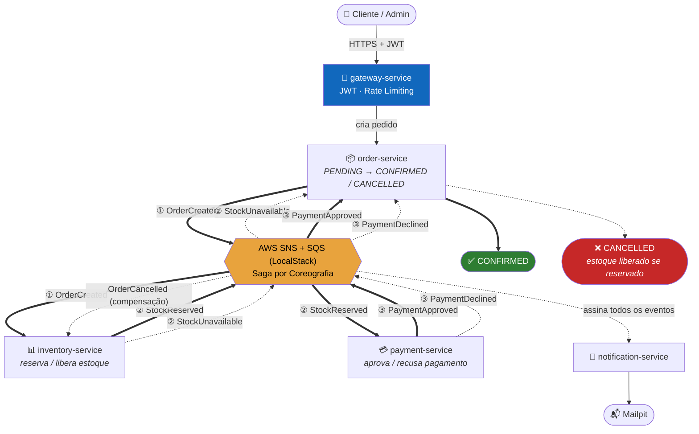

# ecommerce-microservices

[](https://github.com/gutomelo/ecommerce-microservices/actions/workflows/ci.yml)


Plataforma de e-commerce baseada em microsserviços, orientada a eventos (Event-Driven Architecture), construída como referência de boas práticas do ecossistema Spring para portfólio técnico.

Backend distribuído de e-commerce com **9 microsserviços autônomos**, coordenados por uma **Saga por Coreografia** sobre **AWS SNS/SQS** (simulados localmente via **LocalStack**) — sem orquestrador central. Segue **DDD**, **Clean/Hexagonal Architecture** e os **Twelve-Factor App**. Todo o fluxo — incluindo os dois caminhos de compensação da Saga, idempotência, rate limiting e observabilidade — foi validado com um [teste de integração real de ponta a ponta](#validação-end-to-end), subindo a stack inteira via Docker Compose e exercitando cada serviço de verdade (nada mockado).

> O código do projeto (Maven multi-módulo, serviços, docs) vive todo dentro de [`ecommerce-platform/`](ecommerce-platform/). Só `.github/workflows/` fica na raiz do repositório git (aqui), porque é onde o GitHub Actions exige que esteja.

## Stack

Java 21 · Spring Boot 3 · Spring Cloud (Config, Gateway) · Spring Cloud AWS (SNS/SQS) · Spring Data JPA · Spring Security + JWT · PostgreSQL · Flyway · Docker / Docker Compose · LocalStack · Resilience4j (Retry, Circuit Breaker, Rate Limiter) · Micrometer · OpenTelemetry · Prometheus · Grafana · Jaeger · Mailpit · JUnit 5 · Mockito · Testcontainers · JaCoCo.

## Arquitetura

Visão da Saga por Coreografia ponta a ponta — do request no Gateway até a confirmação/cancelamento do pedido e o e-mail de notificação. Setas sólidas verdes = caminho feliz; setas tracejadas vermelhas = compensação. Diagramas C4 completos (contexto e contêineres, com todos os 9 serviços e bancos) em [`ecommerce-platform/docs/diagrams/`](ecommerce-platform/docs/diagrams/).



- **Saga por Coreografia**: `order-service` cria o pedido (`PENDING`) e publica `OrderCreated`. `inventory-service` reserva estoque e publica `StockReserved`/`StockUnavailable`. `payment-service` decide aprovar/recusar e publica `PaymentApproved`/`PaymentDeclined`. `order-service` reage a esses dois últimos e fecha o pedido (`CONFIRMED`/`CANCELLED`, com `inventory-service` liberando o estoque na compensação). `notification-service` observa tudo e envia e-mail/SMS.
- **Outbox Pattern** em todo serviço publicador (a mudança de estado e o registro do evento a publicar são commitados na mesma transação; um worker assíncrono publica de fato no SNS).
- **Idempotent Consumer** em todo serviço consumidor (tabela `processed_events` — reentrega do SQS nunca duplica efeito).
- **Retry + Circuit Breaker + DLQ**: publicação no SNS protegida por Resilience4j (retry com backoff + circuit breaker); toda fila SQS tem DLQ própria com `maxReceiveCount` configurado.
- Módulo `platform/` compartilha infraestrutura (eventos, mensageria, segurança, observabilidade, exceções, testes) sem nenhuma regra de negócio.

Diagramas C4, fluxo completo da Saga, catálogo de eventos e ADRs: ver [`ecommerce-platform/docs/`](ecommerce-platform/docs/) (índice abaixo).

## Validação end-to-end

Além da suíte automatizada, a stack inteira foi validada em tempo real: cold start completo via Docker Compose, os 9 serviços + 7 bancos exercitados de verdade, e as três ramificações da Saga provadas ponta a ponta com evidência concreta (não só asserção de teste):

- **Caminho feliz**, compensação por **pagamento recusado** e compensação por **estoque indisponível** — cada uma confirmada por e-mail real recebido no Mailpit e pelo estado final correto de estoque/pagamento no banco.
- **Idempotência**: reenvio real da mesma mensagem SQS (`eventId` repetido) não duplica o efeito.
- **Rate limiting** do gateway: disparo de 40 requisições confirmou o corte exato no limite configurado.
- **Observabilidade**: todos os alvos do Prometheus `up`, datasources do Grafana provisionados, traces reais capturados no Jaeger.
- Esse processo encontrou e corrigiu um bug real (`createdAt` nulo após update em `customer-service`/`product-service`, por reconstrução de entidade JPA transiente) — com teste de regressão adicionado em ambos os serviços.

## Como rodar

```bash
cd ecommerce-platform
./mvnw clean package -DskipTests
docker compose build
docker compose up -d
```

Sobe sozinho: LocalStack (com os 7 tópicos SNS e 4 filas SQS/DLQ já criados), 7 PostgreSQL, `config-server`, `gateway-service`, os 7 microsserviços de negócio, Prometheus, Grafana, Jaeger e Mailpit. Um usuário `ADMIN` já vem semeado (`admin@ecommerce-platform.local` / `Admin@12345`).

Guia completo (fluxo de fumaça via `curl`, portas de cada serviço, como acessar Grafana/Jaeger/Mailpit): **[`ecommerce-platform/docs/deployment/local.md`](ecommerce-platform/docs/deployment/local.md)**.

## Produção (AWS)

Terraform completo em [`ecommerce-platform/infrastructure/terraform/`](ecommerce-platform/infrastructure/terraform/) provisiona a mesma arquitetura acima rodando numa conta AWS real — nenhum código de serviço muda, só a origem de configuração/credenciais (ver [ADR 0003](ecommerce-platform/docs/decisions/0003-ecs-fargate-para-producao-na-aws.md) e as [notas de migração](ecommerce-platform/docs/deployment/aws.md)):

- **Compute**: ECS Fargate — um serviço por container (9 microsserviços + Prometheus/Grafana/Jaeger), service discovery via AWS Cloud Map.
- **Dados**: 1 RDS PostgreSQL por serviço + Secrets Manager (JWT, credenciais de banco, senha do Grafana — nunca em texto puro).
- **Mensageria**: os mesmos 7 tópicos SNS + 4 filas SQS/DLQ do catálogo de eventos, com uma IAM role por serviço restrita a publicar/consumir exatamente o que aquele serviço publica/consome no catálogo (least privilege).
- **Rede**: VPC com subnets públicas/privadas, ALB público só na frente do `gateway-service`, ALB **interno** (nunca exposto à internet por padrão) para Prometheus/Grafana/Jaeger.
- Validado com `terraform validate`/`terraform plan` (grafo de dependências resolve por completo, todas as ~9 ações de criação planejadas corretamente); falta só uma conta AWS real para `apply`.

Instalação:

```bash
cd ecommerce-platform/infrastructure/terraform/environments/prod
cp terraform.tfvars.example terraform.tfvars   # ajuste ao menos admin_cidr_blocks
terraform init -backend-config=backend.hcl      # bucket S3 + tabela DynamoDB de lock (bootstrap manual, ver guia)
terraform plan
terraform apply
```

Depois do primeiro `apply` (cria o ECR vazio), publique as imagens Docker e reaplique. Passo a passo completo — bootstrap do state remoto, build/push das imagens, e as lacunas do lado da aplicação que ainda faltam antes de apontar para uma conta real (isolar o profile `local` no config-repo, trocar o e-mail para Amazon SES) — em **[`ecommerce-platform/infrastructure/terraform/README.md`](ecommerce-platform/infrastructure/terraform/README.md)**.

## Testes

```bash
cd ecommerce-platform
./mvnw clean verify
```

Testes unitários (JUnit 5 + Mockito) e de integração reais (Testcontainers: PostgreSQL e LocalStack de verdade — nunca mocks para infraestrutura) em todos os módulos. Gate de cobertura JaCoCo **≥ 80%** por módulo, obrigatório para o build passar. CI: [`.github/workflows/ci.yml`](.github/workflows/ci.yml).

## Microsserviços

| Serviço | Responsabilidade | Escuta | Publica |
|---|---|---|---|
| [`gateway-service`](ecommerce-platform/services/gateway-service/README.md) | Roteamento, JWT, rate limiting | — | — |
| [`config-server`](ecommerce-platform/services/config-server/README.md) | Configuração centralizada | — | — |
| [`auth-service`](ecommerce-platform/services/auth-service/README.md) | Login, cadastro, JWT, refresh token | — | — |
| [`customer-service`](ecommerce-platform/services/customer-service/README.md) | CRUD de clientes | — | — |
| [`product-service`](ecommerce-platform/services/product-service/README.md) | CRUD de produtos | — | — |
| [`order-service`](ecommerce-platform/services/order-service/README.md) | Cria pedidos, núcleo da Saga | `PaymentApproved`, `PaymentDeclined`, `StockUnavailable` | `OrderCreated`, `OrderConfirmed`, `OrderCancelled` |
| [`inventory-service`](ecommerce-platform/services/inventory-service/README.md) | Reserva/libera estoque | `OrderCreated`, `OrderCancelled` | `StockReserved`, `StockUnavailable` |
| [`payment-service`](ecommerce-platform/services/payment-service/README.md) | Processa pagamento (simulado, por limite) | `StockReserved` | `PaymentApproved`, `PaymentDeclined` |
| [`notification-service`](ecommerce-platform/services/notification-service/README.md) | E-mail (Mailpit) / SMS (log) | todos os 7 eventos | — |

## Módulo `platform/`

Bibliotecas Maven compartilhadas, sem regra de negócio — cada serviço acima depende só do que precisa.

| Módulo | Responsabilidade |
|---|---|
| [`platform-bom`](ecommerce-platform/platform/platform-bom/README.md) | BOM: centraliza toda versão de dependência |
| [`platform-common`](ecommerce-platform/platform/platform-common/README.md) | `ApiResponse`/`PageResponse`/`ErrorResponse`, superclasses JPA, utilitários |
| [`platform-events`](ecommerce-platform/platform/platform-events/README.md) | Contratos dos 7 eventos de domínio da Saga |
| [`platform-exception`](ecommerce-platform/platform/platform-exception/README.md) | Exceções de negócio + handler global de erro |
| [`platform-security`](ecommerce-platform/platform/platform-security/README.md) | JWT: geração, validação, filtro, roles |
| [`platform-messaging`](ecommerce-platform/platform/platform-messaging/README.md) | Publish/consume SNS/SQS, Outbox, Idempotent Consumer, Retry + Circuit Breaker |
| [`platform-observability`](ecommerce-platform/platform/platform-observability/README.md) | Correlation ID, tracing, métricas, log estruturado |
| [`platform-testing`](ecommerce-platform/platform/platform-testing/README.md) | Fixtures de evento, JWT de teste, bases de Testcontainers |

## `infrastructure/`

Configuração de tudo que sobe via `docker-compose.yml` mas não é código Java.

| Diretório | O que configura |
|---|---|
| [`localstack`](ecommerce-platform/infrastructure/localstack/README.md) | Cria os 7 tópicos SNS e 4 filas SQS/DLQ da Saga automaticamente |
| [`config-repo`](ecommerce-platform/infrastructure/config-repo/README.md) | Configuração compartilhada servida pelo `config-server` (JWT secret, endpoint do LocalStack, etc.) |
| [`prometheus`](ecommerce-platform/infrastructure/prometheus/README.md) | Scrape config — um alvo por microsserviço |
| [`grafana`](ecommerce-platform/infrastructure/grafana/README.md) | Provisionamento automático de datasources (Prometheus + Jaeger) |
| [`terraform`](ecommerce-platform/infrastructure/terraform/README.md) | Infraestrutura de **produção real na AWS** (VPC, ECS Fargate, RDS, SNS/SQS, ALB, Secrets Manager) — validada com `terraform validate`/`plan` |

## Estrutura do repositório

```text
ecommerce-microservices/          # raiz do repositório git
├── .github/workflows/ci.yml      # CI (só pode ficar na raiz do repo, exigência do GitHub Actions)
└── ecommerce-platform/           # o projeto em si
    ├── platform/                 # bibliotecas Maven compartilhadas (sem regra de negócio)
    ├── services/                 # os 9 microsserviços, cada um com seu README
    ├── infrastructure/           # LocalStack init, config-repo, Prometheus, Grafana, Terraform de produção
    ├── docs/                     # arquitetura, diagramas, eventos, saga, API, deployment, ADRs
    ├── docker-compose.yml
    ├── pom.xml                   # Maven Multi-Module raiz
    └── CLAUDE.md                 # contexto para desenvolvimento assistido por IA
```

## Desenvolvimento assistido por IA (Claude Code)

Este projeto foi construído com [Claude Code](https://claude.com/claude-code) seguindo uma prática de **Context Engineering**: em vez de gerar código a partir de prompts soltos, o repositório carrega um contexto estruturado que qualquer sessão de IA (ou dev humano) lê antes de tocar no código, em [`ecommerce-platform/.claude/`](ecommerce-platform/.claude/):

- **[`CLAUDE.md`](ecommerce-platform/CLAUDE.md)** — a "memória" do projeto: stack, estrutura alvo do monorepo, tabela de responsabilidades de cada serviço e onde encontrar cada regra.
- **[`.claude/rules/`](ecommerce-platform/.claude/rules/)** (10 arquivos) — regras não negociáveis carregadas em toda sessão: arquitetura hexagonal, comunicação só por eventos (nunca REST síncrono entre serviços), um banco por serviço, idioma (código em inglês, docs em português), segurança, resiliência, observabilidade, testes. É o que manteve os 9 microsserviços — implementados em marcos/sessões separados — consistentes entre si.
- **[`.claude/skills/`](ecommerce-platform/.claude/skills/)** (3 skills) — automações reutilizáveis: `novo-microsservico` (scaffold completo, já registrado no Maven e no `docker-compose.yml`), `novo-evento-dominio` (novo evento em `platform-events` + catálogo + produtor/consumidor ligados), `novo-adr` (registra decisão arquitetural no formato padrão).
- **[`docs/decisions/`](ecommerce-platform/docs/decisions/)** — Architecture Decision Records geradas durante a implementação (ex.: Saga por coreografia vs. orquestração; Mailpit para e-mail local).

O planejamento em marcos, a implementação dos 9 microsserviços e do módulo `platform/`, a infraestrutura, os testes (unitários + Testcontainers), o CI e a bateria de [testes de integração real](#validação-end-to-end) foram todos feitos nessa parceria entre engenharia de contexto e execução por IA — o repositório documenta o processo tanto quanto o resultado.

## Documentação

- [`ecommerce-platform/CLAUDE.md`](ecommerce-platform/CLAUDE.md) — visão geral para desenvolvimento assistido por IA (stack, regras, estrutura).
- [`ecommerce-platform/docs/architecture/visao-geral.md`](ecommerce-platform/docs/architecture/visao-geral.md) — arquitetura detalhada.
- [`ecommerce-platform/docs/diagrams/`](ecommerce-platform/docs/diagrams/) — diagramas C4 (contexto e contêineres).
- [`ecommerce-platform/docs/saga/fluxo-saga.md`](ecommerce-platform/docs/saga/fluxo-saga.md) — fluxo completo da Saga (sucesso e compensação).
- [`ecommerce-platform/docs/events/catalogo-eventos.md`](ecommerce-platform/docs/events/catalogo-eventos.md) — catálogo de eventos, tópicos e filas.
- [`ecommerce-platform/docs/api/`](ecommerce-platform/docs/api/) — especificações OpenAPI de cada serviço.
- [`ecommerce-platform/docs/deployment/local.md`](ecommerce-platform/docs/deployment/local.md) — guia de execução local.
- [`ecommerce-platform/docs/deployment/aws.md`](ecommerce-platform/docs/deployment/aws.md) — notas de migração para AWS real.
- [`ecommerce-platform/infrastructure/terraform/README.md`](ecommerce-platform/infrastructure/terraform/README.md) — guia completo de instalação em produção (Terraform).
- [`ecommerce-platform/docs/decisions/`](ecommerce-platform/docs/decisions/) — Architecture Decision Records.
