# Diagrama de contêineres (C4 - Nível 2)

Visão interna do sistema `ecommerce-platform` (ver [diagrama de contexto](c4-contexto.md)). Cada retângulo é um contêiner implantável (um `docker-compose.yml` service). Fluxo detalhado da Saga: [`docs/saga/fluxo-saga.md`](../saga/fluxo-saga.md). Catálogo completo de eventos: [`docs/events/catalogo-eventos.md`](../events/catalogo-eventos.md).

```mermaid
flowchart TB
    customer(["Cliente"])
    admin(["Administrador"])

    gateway["<b>gateway-service</b><br/><i>Spring Cloud Gateway (WebFlux)</i><br/>Roteamento, validação de JWT, rate limiting"]
    config["<b>config-server</b><br/><i>Spring Cloud Config</i><br/>Configuração centralizada"]

    subgraph support[" Serviços de suporte "]
        direction LR
        auth["<b>auth-service</b><br/>Login, cadastro, JWT"]
        customerSvc["<b>customer-service</b><br/>CRUD de clientes"]
        productSvc["<b>product-service</b><br/>CRUD de produtos"]
    end

    subgraph saga[" Núcleo da Saga (coreografia via eventos) "]
        direction LR
        order["<b>order-service</b><br/>Cria pedidos<br/>Outbox Pattern"]
        inventory["<b>inventory-service</b><br/>Reserva/libera estoque"]
        payment["<b>payment-service</b><br/>Processa pagamento simulado"]
        notification["<b>notification-service</b><br/>E-mail (Mailpit) / SMS (log)"]
    end

    broker{{"<b>AWS SNS + SQS</b><br/><i>LocalStack em dev/demo</i><br/>7 tópicos, 4 filas + DLQs<br/>(fan-out da Saga)"}}

    dbAuth[("postgres-auth")]
    dbCustomer[("postgres-customer")]
    dbProduct[("postgres-product")]
    dbOrder[("postgres-order")]
    dbInventory[("postgres-inventory")]
    dbPayment[("postgres-payment")]
    dbNotification[("postgres-notification")]

    mailpit(["Mailpit<br/>(SMTP fake)"])
    obs["Prometheus + Grafana + Jaeger<br/><i>Observabilidade</i>"]

    customer --> gateway
    admin --> gateway

    gateway --> auth & customerSvc & productSvc & order & inventory & payment

    auth -.->|config| config
    customerSvc -.->|config| config
    productSvc -.->|config| config
    order -.->|config| config
    inventory -.->|config| config
    payment -.->|config| config
    notification -.->|config| config
    gateway -.->|config| config

    auth --> dbAuth
    customerSvc --> dbCustomer
    productSvc --> dbProduct
    order --> dbOrder
    inventory --> dbInventory
    payment --> dbPayment
    notification --> dbNotification

    order <==> broker
    inventory <==> broker
    payment <==> broker
    notification ==>|"assina todos os<br/>7 tópicos"| broker
    notification --> mailpit

    order -.-> obs
    inventory -.-> obs
    payment -.-> obs
    notification -.-> obs
    gateway -.-> obs

    style gateway fill:#1168bd,color:#fff
    style broker fill:#e8a33d,color:#000
    style obs fill:#999,color:#fff
```

## Leitura do diagrama

- **Setas sólidas grossas (`<==>`)**: comunicação assíncrona via SNS/SQS — a única forma de `order-service`, `inventory-service`, `payment-service` e `notification-service` trocarem informação entre si (nunca REST direto, ver [`.claude/rules/arquitetura.md`](../../.claude/rules/arquitetura.md)).
- **Setas sólidas finas**: chamada HTTP síncrona (só existe do Gateway para um serviço, nunca serviço-a-serviço).
- **Setas tracejadas**: dependência de configuração (Config Server) ou telemetria (Prometheus/Grafana/Jaeger) — não fazem parte do fluxo de negócio.
- Cada serviço com estado tem seu **próprio** PostgreSQL, sem exceção (ver [`.claude/rules/banco-de-dados.md`](../../.claude/rules/banco-de-dados.md)). `gateway-service` e `config-server` não têm banco.
- O módulo `platform/` (bibliotecas Maven compartilhadas) não aparece aqui por não ser um contêiner implantável — ver [`.claude/rules/modulo-platform.md`](../../.claude/rules/modulo-platform.md).
