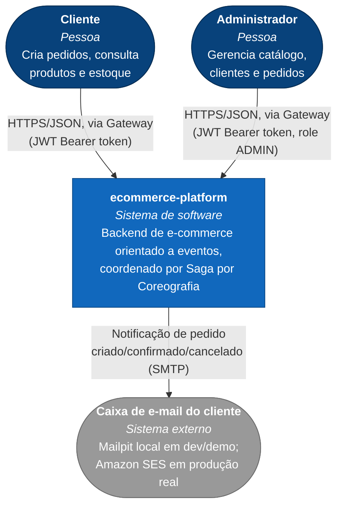

# Diagrama de contexto (C4 - Nível 1)

Visão de mais alto nível: quem usa a plataforma e com quais sistemas externos ela se comunica. Detalhes internos (microsserviços, banco, mensageria) ficam no [diagrama de contêineres](c4-containers.md).

## Leitura do diagrama

- **Cliente** e **Administrador** nunca falam diretamente com um microsserviço — toda entrada é via `gateway-service`, autenticada por JWT emitido pelo `auth-service`.
- O único sistema externo real é a caixa de e-mail do cliente. Localmente, quem recebe esse e-mail é o **Mailpit** (`http://localhost:8026`); em produção seria o provedor de e-mail real do cliente, com a plataforma falando com **Amazon SES** (ver [`docs/deployment/aws.md`](../deployment/aws.md)).
- SMS é apenas logado localmente (sem sistema externo real ainda - ver [ADR 0002](../decisions/0002-mailpit-para-email-local-e-log-para-sms.md)).
