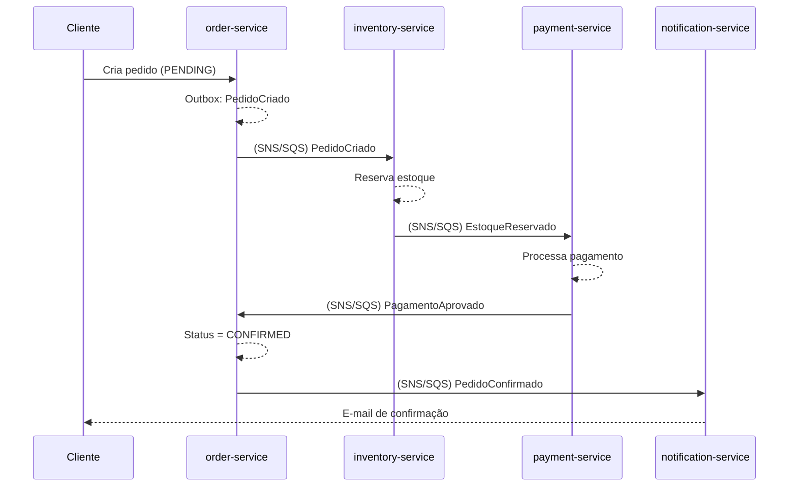
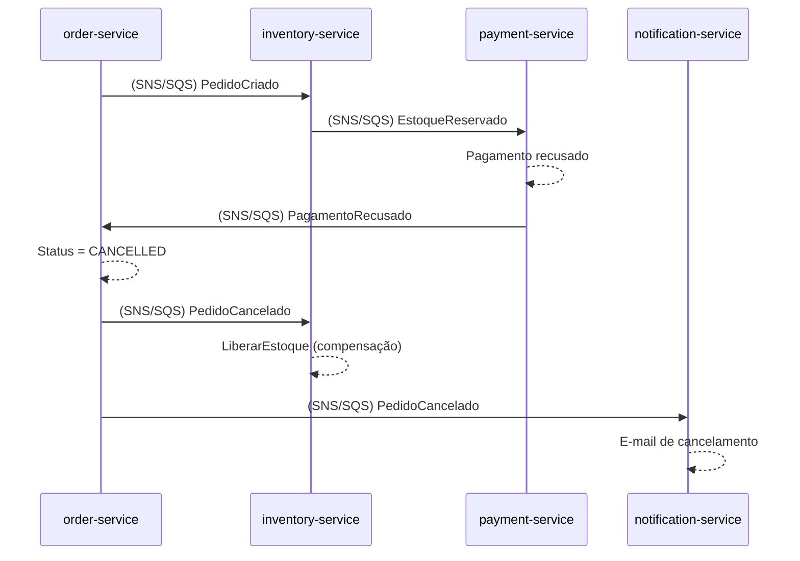

# Fluxo da Saga (Coreografia)

Nenhum serviço chama outro diretamente. Toda a coordenação acontece através da publicação e do consumo de eventos via SNS/SQS. O `correlationId` é gerado na criação do pedido e propagado em todos os eventos subsequentes da mesma transação distribuída.

## Fluxo de sucesso

## Fluxo de compensação

## Caso alternativo: estoque indisponível

Se `inventory-service` não conseguir reservar estoque ao receber `PedidoCriado`, publica `EstoqueIndisponivel` em vez de `EstoqueReservado`. `order-service` escuta esse evento, cancela o pedido (`PedidoCancelado`) e `notification-service` envia o e-mail de indisponibilidade/cancelamento. `payment-service` nunca chega a ser acionado nesse caminho.

## Regras que todo passo da Saga deve respeitar

- Cada transição de estado é local ao serviço dono do agregado (`order-service` é o único que muda o status do pedido).
- Toda publicação segue o Outbox Pattern; todo consumo verifica idempotência antes de agir (ver [`.claude/rules/comunicacao-eventos.md`](../../.claude/rules/comunicacao-eventos.md)).
- Falhas de negócio (`EstoqueIndisponivel`, `PagamentoRecusado`) disparam compensação, não retry/DLQ.
